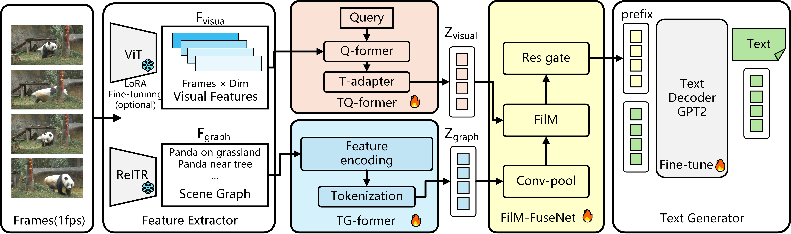

# ViS2T: A Vision and Scene Graph to Text Model for Captive Giant Panda Video Captioning

## 1. Introduction

This repository provides the code, pretrained resources, training scripts, and evaluation scripts for the ViS2T model. ViS2T is a Vision-and-Scene-Graph-to-Text model for captive giant panda video captioning, designed to generate natural language descriptions from visual content and scene relationships in videos.

The task takes a giant panda behavior video as input and generates a corresponding text description automatically. The overall model architecture is shown below:



## 2. Environment Setup

Create the environment with `conda`:

```bash
conda env create -f environment.yml
conda activate opcv
```

If `environment.yml` does not install correctly, you can install the dependencies manually:

```bash
conda create -n opcv python=3.10 -y
conda activate opcv
pip install torch torchvision torchaudio --index-url https://download.pytorch.org/whl/cu128
pip install transformers timm accelerate pandas pillow opencv-python matplotlib nltk pycocotools pycocoevalcap rouge-score
```

After installation, you can run the following command to check the environment:

```bash
python -c "import torch, transformers, cv2, pandas; print(torch.__version__)"
```

Note: some scripts still use local absolute paths. Please change them to paths under the current repository before running. For example, use `pretrained/gpt2` as the GPT-2 model directory.

## 3. Dataset

This repository uses data under `dataset/panda` by default.

- Put the raw videos in `dataset/panda/videos/`
- Put the train/test split files in `dataset/panda/train_data.csv` and `dataset/panda/test_data.csv`
- Put the annotation file in `dataset/panda/20250808.json`

If you want to reproduce results on public datasets, you can refer to:

- MSRVTT: https://huggingface.co/datasets/friedrichor/MSR-VTT
- MSVD: https://huggingface.co/datasets/friedrichor/MSVD

Example dataset structure:

```text
dataset/panda/
├─ videos/
├─ scene/
├─ lora_detail/
├─ train_data.csv
├─ test_data.csv
├─ caption.json
```

Example annotation format:

```json
[
  {
    "video": "video_0001",
    "short": ["short caption"],
    "detail": ["detailed caption"]
  }
]
```

## 4. Pretrained Models

Prepare the following weights in advance and place them under the corresponding directories in `pretrained/`:

- CLIP ViT-B/32: put it in `pretrained/vit/`
- GPT-2: put it in `pretrained/gpt2/`
- LoRA weights: put them in `pretrained/lora/`, and keep the filenames as `lora_action.pt` or `lora_detail.pt`
- RelTR weights: download and configure them according to the `RelTR` repository

Reference links:

- CLIP: https://huggingface.co/openai/clip-vit-base-patch32
- GPT-2: https://huggingface.co/openai-community/gpt2
- RelTR: https://github.com/yrcong/RelTR

## 5. Feature Extraction

Before training, visual features and scene graph features need to be extracted first.

- CLIP+LoRA feature extraction: `python extract_clip_lora_features.py --text_mode detail --split both`
- The default output directory is `dataset/panda/lora_detail/`
- Scene graph feature extraction: use `RelTR/scene_graph.py`
- The default output directory is `dataset/panda/scene/`

If you change data paths or weight paths, update the default arguments in the scripts accordingly.

## 6. Code Overview

- `train_feature.py`: main training script. Run it with `python train_feature.py`. Training logs, model checkpoints, and generated results for each epoch will be saved under `logs/timestamp/`
- There is currently no separate standalone inference script. For now, you can reuse the generation logic in `train_feature.py`. If you only want inference, load a trained checkpoint and reuse the `model(batch, 'generate')` part
- `evaluate.py`: evaluation script, supporting `CIDEr`, `BLEU-4`, `ROUGE-L`, and `METEOR`
- `dataset/mydataloader.py`: data loading code
- `model/`: model definitions
- `qwen/comp_qwen.py`: Qwen inference-related code
- `pretrained/lora/`: LoRA weight directory
- `extract_clip_lora_features.py`: extracts visual features with LoRA weights
- `train_clip_lora.py`: LoRA training code
